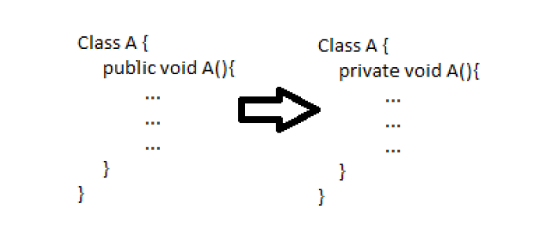

Introduction 

Decrease the visibility of a method from public to protected, protected to package or package to private.

Example:

Pre and Post Conditions 

Pre Conditions: 

1. User must enter the method's name in order to decrease its visibility.

Post Conditions: 

No specific Post Condition

Code