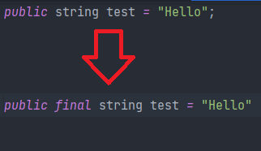

Introduction 

Add the "final" property to a field, so that it never changes once it's initialized.

Example:

Pre and Post Conditions 

Pre Conditions: 

1. User must enter the field's name in order to make it final

Post Conditions: 

1. The value of this field should never be changed in the project

Code