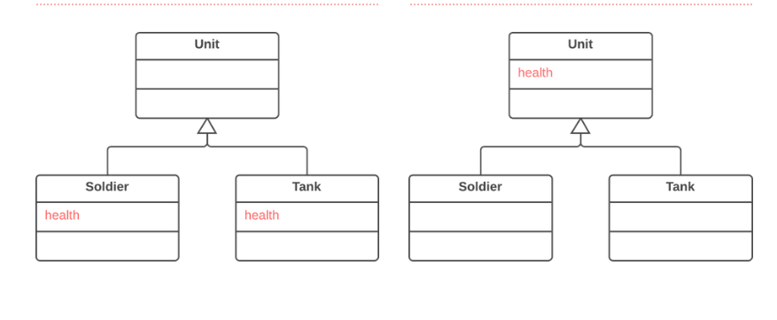

Introduction 

When subclasses grow and get developed separately, identical (or nearly identical) fields and methods appear. 
Pull up method refactoring removes the repetitive field from subclasses and moves it to a superclass.

Example:

Pre and Post Conditions 

Pre Conditions: 

1. There should exist a corresponding child and parent in the project.
2. The field that should be pulled up must be valid.

Post Conditions: 

1. The changed field's usages and callings will also change respectively.
2. There will be children and parents having their desired fields added or removed.

Code