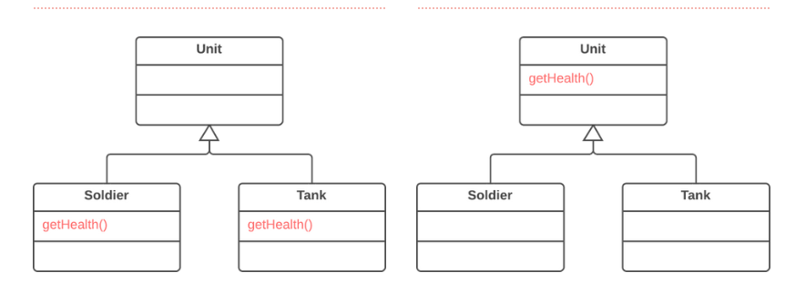

Introduction 

When subclasses grow and get developed separately, your code may have methods that perform similar work.
Pull up method refactoring removes the repetitive method from subclasses and moves it to a superclass.

Example:

Pre and Post Conditions 

Pre Conditions: 

1. The source package, class and method should exist.
2. If the method uses attributes and methods that are defined in the body of the classes, The refactoring should not be done.

Post Conditions: 

No specific Post Condition

Code