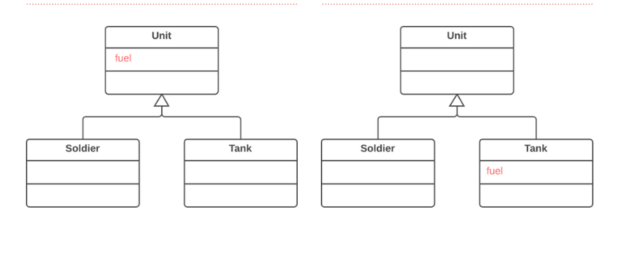

Introduction 

Although it was planned to use a field universally for all classes, in reality the field is used only in
some subclasses. This situation can occur when planned features fail to pan out, for example.
because of this, we push down the field from the superclass into its related subclass.

Example:

Pre and Post Conditions 

Pre Conditions: 

1. There should exist a corresponding child and parent in the project.
2. The field that should be pushed down must be valid.

Post Conditions: 

1. The changed field's usages and callings will also change respectively.
2. There will be children and parents having their desired fields added or removed.

Code