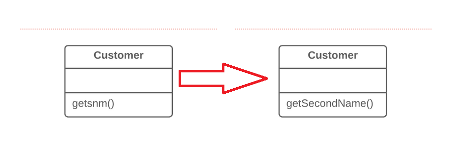

Introduction 

When the name of a method does not explain what the method does (method's functionality), it needs to be changed.

Example:

Pre and Post Conditions 

Pre Conditions: 

1. User must enter the existing method's name, and the new method name in order to rename.

2. Check if the method exist, then rename it.

Post Conditions: 

1. After refactoring, all the old method names in the project should be changed.

Code